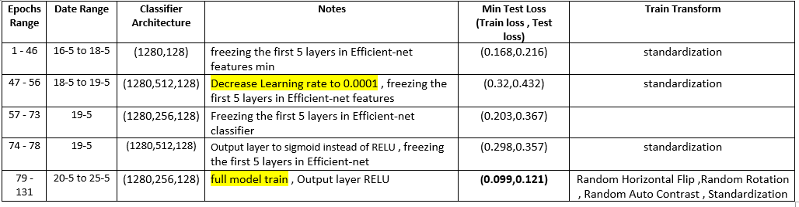

# conv-facenet
- using conv-next as base model for face recognition with pytorch
- the model trained on CelebFaces large-scale face dataset with more than 200K celebrity images with accuracy about 93.8%
- all src code for the model for direct usage exits in [src/efficentfacenet](src/efficentfacenet)

# Dataset
## [CelebFaces Attributes (CelebA) Dataset](https://mmlab.ie.cuhk.edu.hk/projects/CelebA.html) 
<p align="center"> </p>  

- CelebFaces Attributes Dataset (CelebA) is a large-scale face attributes dataset with more than 200K celebrity images
- The images in this dataset cover large pose variations and background clutter. CelebA has large diversities, large quantities
  - 10,177 number of identities
  - 202,599 number of face images
  - dataset is about 10 GB
- Data structure before preparation
  - `dataset/img-celba/xxxxxx.jpg` images folder
  - `dataset/identites.txt` txt file each line has `photo-name identity-number` 
- ### sample images
  - 
# Data preprocessing and preparation
- [Data preprocessing jupyter file](notebooks/data_preprocessing.ipynb)
- using face detector [face-detection](https://github.com/elliottzheng/face-detection) from [elliottzheng](https://github.com/elliottzheng) to detect faces
- align faces to get better learning performance by getting the left and right eye coordinates and rotate the image to make the two eyes on same horizontal line and make them at the center of the image
- resize photos after face extraction and alignment to be square photos 240x240 as input size for the model without image deformation by filling the remaining pixels with black pixels to make the image square image then resize it
- after image resize and face extraction the size of the data decreased from around 10 GB to 2.82 GB which fastens the training performance
## sample
<p align="center"> </p>  

## prepare train and test data
1. read img_name/identity txt file each line has image name and the identity number of this image
2. get identity_pics dictionary `{"identity-number":[list of photos]}`
3. split identities to train and test
4. create train and test folders
5. for each identity create a folder and add it's images in it `person_id/img_name`
- data after preparation structure
  - `train/person_id/xxxxxx.jpg `
  - `test/person_id/xxxxxx.jpg`
## metadata
  ```
no of train identities=7632
no of train photos=147944
mean of photo count for each identity=19

no of test identities=2545
no of test photos=48969
mean of photo count for each identity=19
  ```

# Training process and Data loading
- in this section i will cover 
  - how i trained the model to reach this accuracy and the time taken to train the model
  - efficient random and hard anchor negative selection
  - train history and backbone model selection to start transfer learning from it

## Training goal :
  - we want the model to be able to output the distance between feature vectors for different photos for the same person `anchor and anchor-positive ` be minimum and, the distance between two different persons feature vector `anchor and anchor-negative `be as far as possible
  - 
  - the output features for person face dimension will be 128 feature vector
  


  
## Training algorithm
- first select  person(a)  from all train identities , then select two  pictures for person (a) ` person(a)_pic1 and person(a)_pic2 `
- select  different person (b) then select photo for person (b) ` person(b)_pic1 `
- do three forward steps for each photo , now we have three vectors `person(a)_pic_1 (128 vector) , person(a)_pic_2 (128 vector) , person(b)_pic_1 (128 vector)`
- we want to minimize distance between `person(a)_pic_1 (128 anchor vector) , person(a)_pic_2 (128 anchor postive vector)` (same person) and maximize distance between ` person(a)_pic_1 (128 anchor positive vector) , person(b)_pic_1 (128 anchor negative vector)`
- calculate the **Triplet margin loss** for the three vectors , then do backward step and update model weights 
### loss function
- **Triplet margin loss**
- 

### Anchor negative selection
- first the model trained with **random anchor negative selection** , after (train_loss,test_loss) decreased , the algorithm will be changed to **Hard anchor negative selection**

#### random anchor negative selection
- first select random person(a)  from all train identities , then select two random pictures for person (a)
- select random negative person (b) then select random photo for person (b)
- data loader --> FacesTripletDataset class in [data_loader.py](src/efficentnet_train/data_load.py)
#### Hard anchor negative selection
- before training extract all image features by the last weights checkpoint for the model in a dictionary `img_features_dict key-->"img_full_path" value-->[image feature vector]`
- images used as **anchor negative** image ,it's features are updated after each epoch 
- each train step for one row (anchor , anchor_positive , anchor_negative)
  1. select random person(a)  from all train identities , then select two random pictures for person (a)
  2. select random `n` pictures for different persons (where n is specified in the train loader) 
  3. from the `n` pictures select the path of the picture that has minimum ecludian distance from the anchor image (person which looks similar to person(a) selected in the previous step)
  4. insert the selected photo path in the used images in current epoch to update its feature vectors in the next epoch
- each epoch update `img_features_dict` ,reload used images in previous epoch with the new updated weights after the epoch

## Train data loaders
- [data_load.py](src/efficentnet_train/data_load.py)
- `FacesDataset`
  - parent class for faces dataset loader , loads all identities and each identity photos path
  - the class takes the dataset path , no of rows per epoch , transforms you want to apply for image
  - Calculates  photos usage statistics --> (usage count for each photo and mean usage for the photos and the standard deviation of photo usage ) to ensure that we are training on all photos and random algorithm runs twith uniform distribution
  - uses **Random anchor negative selection**
- `FaceHardSelectionDataset`
  - inherits from `FacesDataset`
  - load all face photos of the given dataset path feature vector to a dictionary (batch loading to fasten features loading)
      - dictionary key : img full path--> 'person_identity/pic_name.jpg' 
      - dictionary value : \[128-feature-vector]
  - uses **Hard anchor negative selection**
  

## Training Loop
- [models_train.py](src/efficentnet_train/models_train.py)
- train loss and test loss logged while training
- model weights saved after each epoch if the test loss reaches a new minimum test loss in the given model weights path
- avg time remaining and time taken  calculated during training
- if there is an overfit the train method prints a warning message
- training history saved in excel sheet it's path given for training method
  - 
### Hard anchor negative train
  


# Train history and backend model selection
- all train history from 15/5/2022 stored in csv file , trying different algorithms and changing the classifier architecture , input normalization , changing learning rate , data loading
## efficientnet model
- I started first with efficientnet-b1 model with a small portion of img-CelbA dataset about 25,000 picture to test the model and select the best architecture for fully connected classifier model

### Train on small subset from data
- 131 epoch form 16/5/2022 to 25/5/2022
- 
- 
